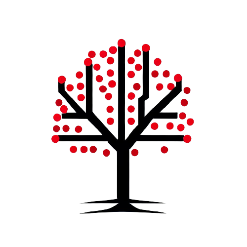

.. TreeSet documentation master file, created by
   sphinx-quickstart.
   You can adapt this file completely to your liking, but it should at least
   contain the root `toctree` directive.

Welcome to TreeSet's documentation!
====================================

.. toctree::
   :maxdepth: 2
   :caption: Contents:

About TreeSet
***************
This project contains a Red-Black Tree (RBT) implementation of the Set data structure in C++. The Red-Black Tree is a self-balancing binary search tree that guarantees O(log n) time complexity for insert, delete, and search operations.

Indices and tables
==================

* :ref:`genindex`
* :ref:`search`
